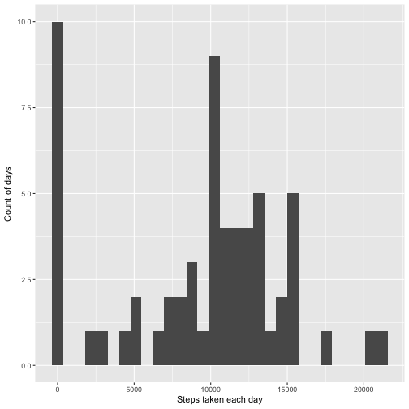
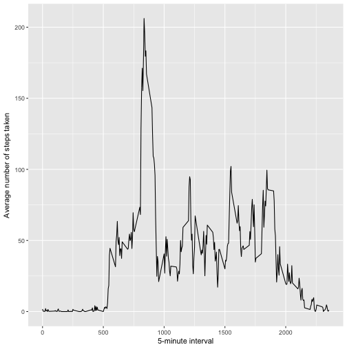
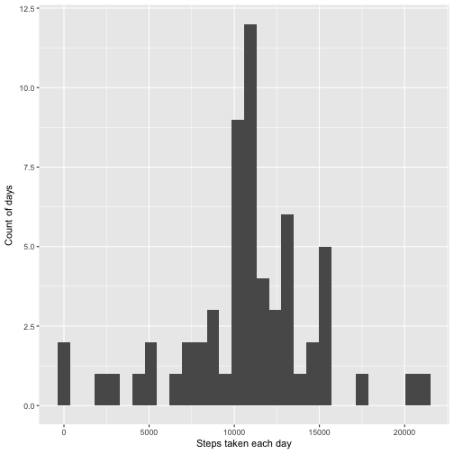
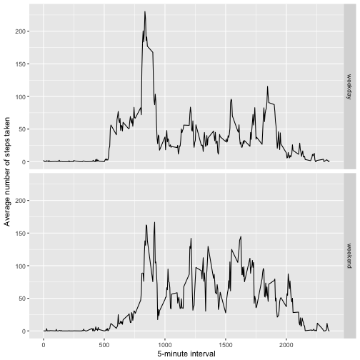

# Reproducible Research: Peer Assessment 1

## Loading and preprocessing the data

Check for the file in your working directory. If it does not already exist, unzip the ```activity.zip``` file. Use ```read.csv``` to read in the data.


```r
if (!file.exists("activity.csv")){
     unzip("activity.zip")   
}
activity <- read.csv("activity.csv")
```

Then, use ```as.POSIXct``` and ```strptime``` to change the class of the date column.


```r
activity$date <- as.POSIXct(strptime(activity$date, "%Y-%m-%d"))
```

## What is mean total number of steps taken per day?

For this analysis, load the ```dplyr``` and ```ggplot2``` packages.


```r
library(dplyr)
library(ggplot2)
```

To calculate the total number of steps taken per day, use the ```dplyr``` functions to create a summary table, setting ```sum``` as the function to be applied to the *steps* column, and setting the *date* as the factor.


```r
activity <- tbl_df(activity)
dailySteps <- activity %>%
        group_by(date) %>%
        summarise(steps = sum(steps, na.rm = TRUE))
```

Then, plot a histogram of the total number of steps taken each day, using ```ggplot```.


```r
ggplot(dailySteps, aes(steps)) +
        geom_histogram() +
        xlab("Steps taken each day") + 
        ylab("Count of days")
```



Finally, calculate the mean of the total number of steps taken per day, using the code below:


```r
mean(dailySteps$steps)
```

```
## [1] 9354.23
```

And for the median:


```r
median(dailySteps$steps)
```

```
## [1] 10395
```


## What is the average daily activity pattern?

To calculate the average daily activity pattern, use the ```dplyr``` functions to create a summary table, setting ```mean``` as the function to be applied to the *steps* column, and setting the *interval* as the factor.


```r
dailyPattern <- activity %>%
        group_by(interval) %>%
        summarise(steps = mean(steps, na.rm = TRUE))
```

Then, use that table to plot a time series of a typical day, using ```ggplot```.


```r
ggplot(dailyPattern, aes(interval, steps)) +
        geom_line() + 
        xlab("5-minute interval") +
        ylab("Average number of steps taken")
```



Finally, determine which five-minute interval has the maximum number of average steps, using the code below:


```r
dailyPattern[which.max(dailyPattern$steps),][[1]]
```

```
## [1] 835
```


## Imputing missing values

Using ```sum``` and ```is.na```, calculate the total number of missing values in the data set.


```r
sum(is.na(activity))
```

```
## [1] 2304
```

To impute missing values, first duplicate the *activity* table. Then, use the ```which``` function to return a list of rows in which there are missing *steps* values. 


```r
activityImpute <- activity
nullValues <- which(is.na(activityImpute$steps))
```

Next, create a ```for``` loop that replaces each missing value with the mean value for that five-minute integer (calculated in a previous step and saved in the *dailyPattern* table).


```r
for (i in nullValues) {
    activityImpute[i, 1] <- filter(dailyPattern, interval == activityImpute[i, 3][[1]])[2]
}
```

To calculate the **new** total number of steps taken per day, use the ```dplyr``` functions to create a summary table, setting ```sum``` as the function to be applied to the *steps* column, and setting the *date* as the factor.


```r
dailyStepsImpute <- activityImpute %>%
        group_by(date) %>%
        summarise(steps = sum(steps, na.rm = TRUE))
```

Again, plot a histogram of the total number of steps taken each day, using ```ggplot```.


```r
ggplot(dailyStepsImpute, aes(steps)) +
        geom_histogram() +
        xlab("Steps taken each day") + 
        ylab("Count of days")
```



Finally, once again calculate the mean of the total number of steps taken per day, using the code below:


```r
mean(dailyStepsImpute$steps)
```

```
## [1] 10766.19
```

And for the median:


```r
median(dailyStepsImpute$steps)
```

```
## [1] 10766.19
```

As you can see, imputing missing data on the estimates of the total daily number of steps had a clear impact. The histogram indicates a more normal distribution, as reflected by the identical mean and median above.

## Are there differences in activity patterns between weekdays and weekends?

To create a new factor variable that specifies whether each day is a weekday or weekend, use a combination of the ```mutate``` and ```ifelse``` functions.


```r
activityImpute <- mutate(activityImpute, dayclass = as.factor(ifelse(weekdays(date) %in% c("Saturday", "Sunday"), "weekend", "weekday")))
```

Again, to calculate the average daily activity pattern, use the ```dplyr``` functions to create a summary table, setting ```mean``` as the function to be applied to the *steps* column, and setting the *interval* as the factor.


```r
dailyPatternImpute <- activityImpute %>%
        group_by(interval, dayclass) %>%
        summarise(steps = mean(steps, na.rm = TRUE))
```

Then, use that table to plot a time series of a typical day, using ```ggplot```. Split the data by the *dayclass* variable using ```facet_grid```.


```r
ggplot(dailyPatternImpute, aes(interval, steps)) +
        geom_line() + 
        facet_grid(dayclass ~ .) +
        xlab("5-minute interval") +
        ylab("Average number of steps taken")
```


